# MDW Wellness Dashboard - Flowcharts

Backend API: WellnessBackend on Render

Base URL: `https://wellness-backend-1-wya5.onrender.com`

All diagrams below use GitHub-safe Mermaid syntax: quoted labels only, no slash-shaped nodes, no special node shapes.

---

## 1. App entry and authentication

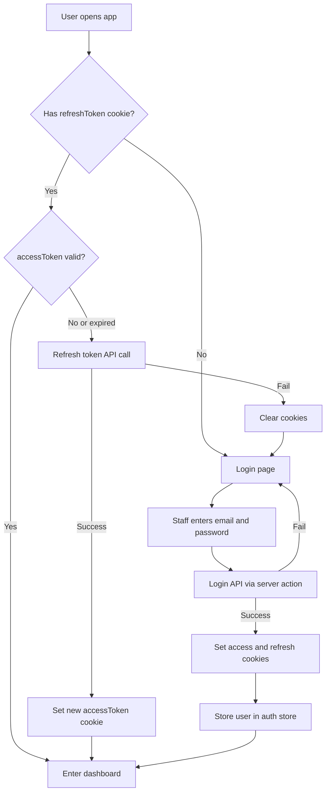

---

## 2. Dashboard shell and role-based navigation

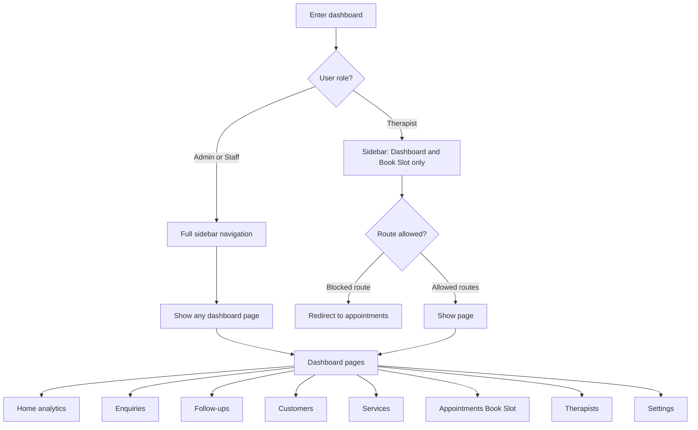

---

## 3. Data layer

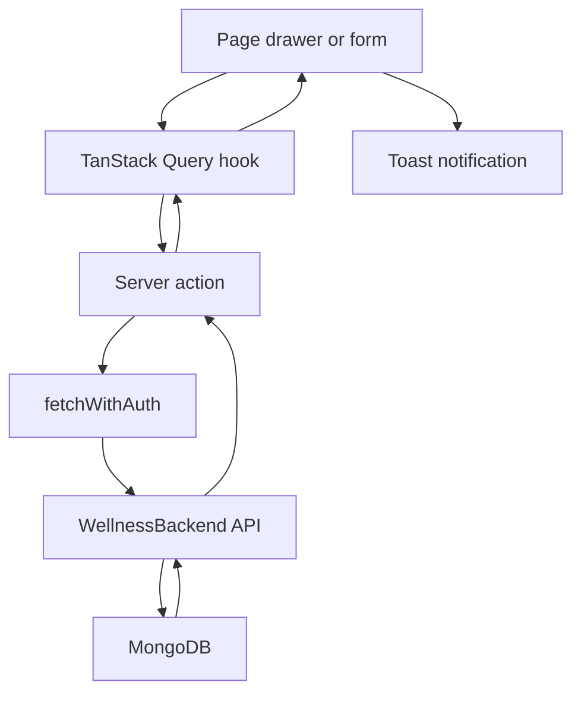

| Domain | Frontend hook | Backend endpoint |
|--------|---------------|------------------|
| Enquiries / Appointments | useGetAllEnquiries, useGetAllAppointments | GET api appointments |
| Create lead / book slot | useCreateEnquiry, useBookAppointment | POST api appointments |
| Update funnel / checklist | useUpdateAppointment | PATCH api appointments by id |
| Services | useGetServices | GET api services |
| Therapists | useGetAllTherapist | GET api therapists |
| Staff users | useGetAllUsers | GET api users getallusers |
| Login / refresh | login action, middleware | POST api users login and refresh |
| Customers | useGetCustomers client-side | GET api appointments grouped by phone |
| Dashboard KPIs | derived in components | enquiries therapists services lists |

---

## 4. Lead sources

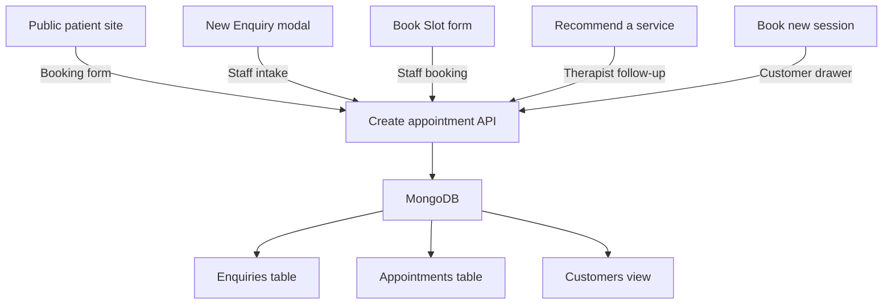

---

## 5. Enquiry funnel

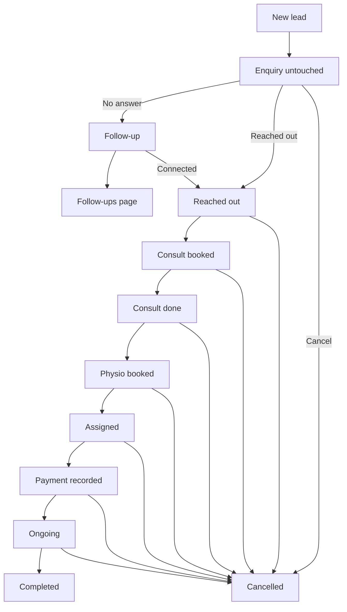

---

## 6. Enquiries page

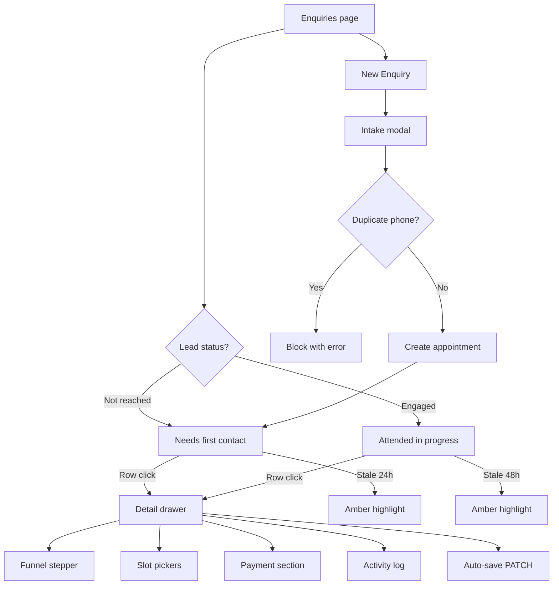

---

## 7. Appointments page

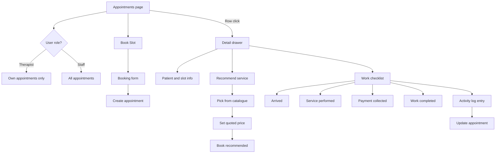

---

## 8. Customers page

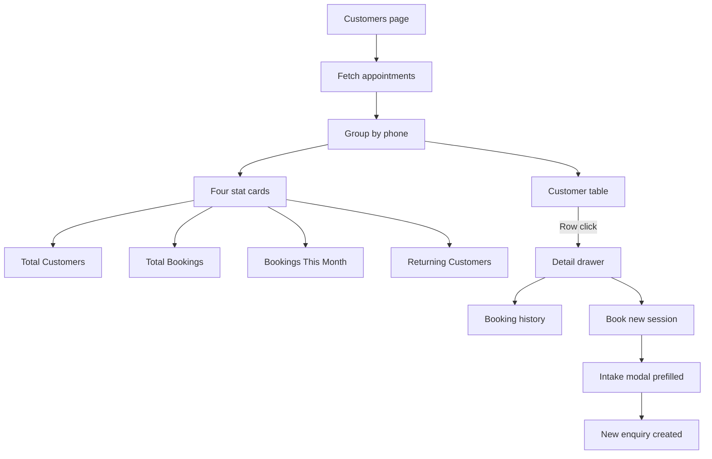

---

## 9. Services and therapists

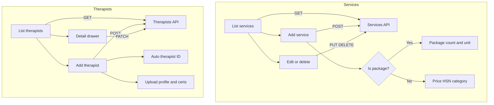

---

## 10. Settings

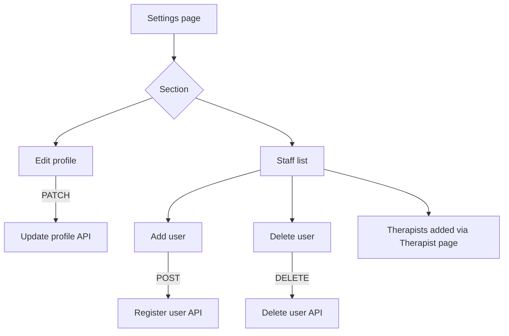

---

## 11. End-to-end journey

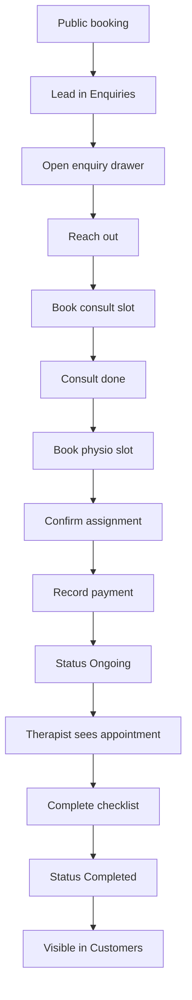

---

## 12. Planned invoice flow

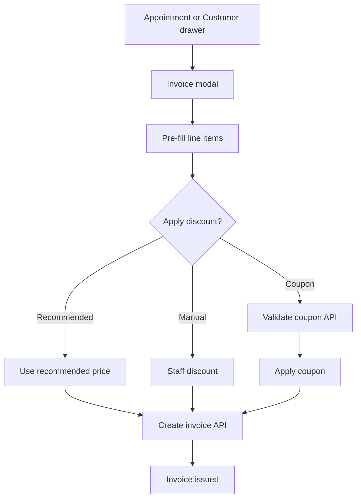
