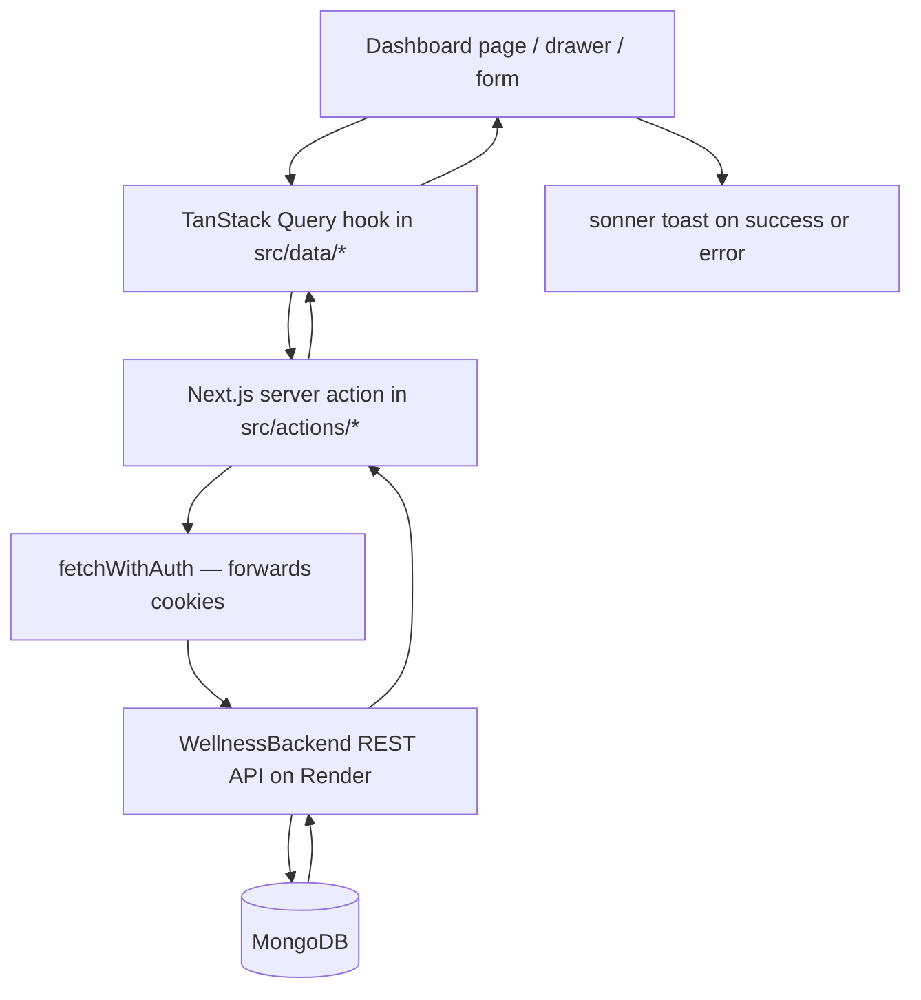
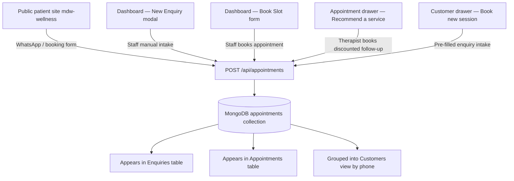
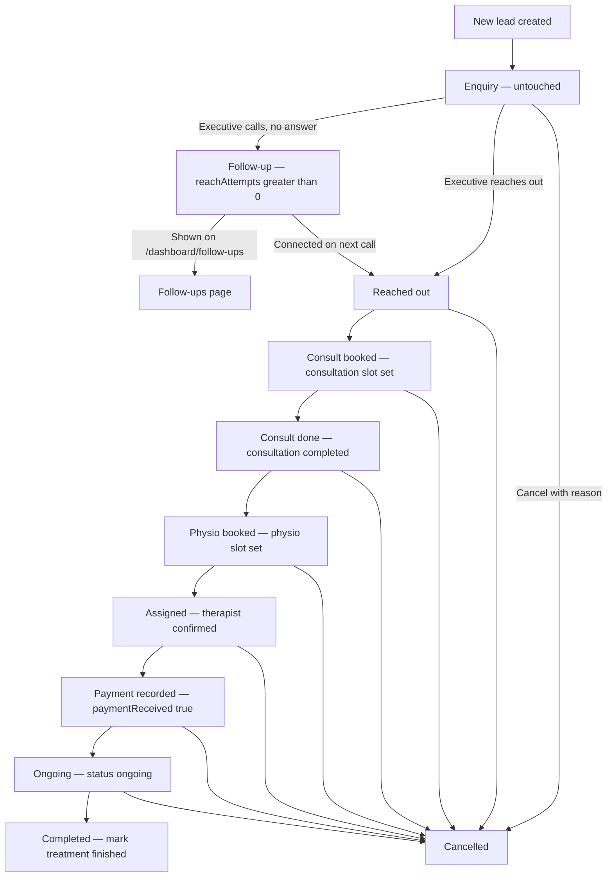
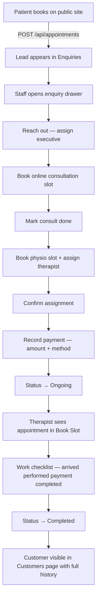
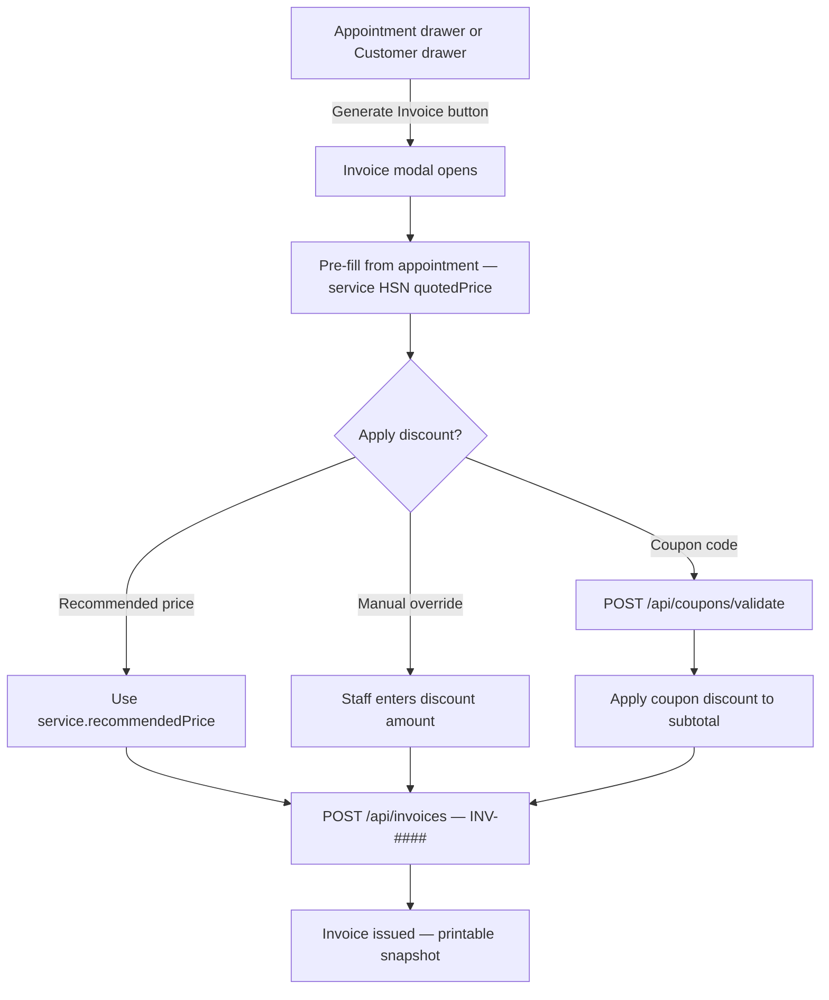

# MDW Wellness Dashboard — Flowcharts

Backend API: `WellnessBackend` on Render (`BACKEND_BASE_URL` → `https://wellness-backend-1-wya5.onrender.com`)

---

## 1. App entry and authentication

```mermaid
flowchart TD
    A[User opens app] --> B{Has refreshToken cookie?}
    B -->|No| C[/auth/login]
    B -->|Yes| D{accessToken valid?}
    D -->|Yes| E[Enter dashboard]
    D -->|No / expired| F[POST /api/users/refresh-token]
    F -->|Success| G[Set new accessToken cookie]
    G --> E
    F -->|Fail| H[Clear cookies]
    H --> C
    C --> I[Staff enters email + password]
    I --> J[POST /api/users/login via server action]
    J -->|Success| K[Set accessToken + refreshToken cookies]
    K --> L[Store user in Zustand auth store]
    L --> E
    J -->|Fail| C
```

---

## 2. Dashboard shell and role-based navigation

```mermaid
flowchart TD
    E[Enter /dashboard] --> R{User role?}
    R -->|THERAPIST| TNav[Sidebar: Dashboard + Book Slot only]
    R -->|Admin / Staff / Customer Care / Super Admin| FNav[Full sidebar navigation]
    TNav --> TGuard{Route allowed?}
    TGuard -->|/dashboard or /dashboard/appointments or /dashboard/settings| TPage[Show page]
    TGuard -->|Any other route| TRedirect[Redirect to /dashboard/appointments]
    FNav --> FPage[Show any dashboard page]
    FPage --> Pages
    TPage --> Pages
    Pages --> P1[/dashboard — Analytics home]
    Pages --> P2[/dashboard/enquiries — Lead funnel]
    Pages --> P3[/dashboard/follow-ups — Unreachable leads]
    Pages --> P4[/dashboard/customers — Customer bookings]
    Pages --> P5[/dashboard/services — Service catalogue]
    Pages --> P6[/dashboard/appointments — Book Slot]
    Pages --> P7[/dashboard/alltherapist — Therapist roster]
    Pages --> P8[/dashboard/settings — Users and profile]
```

---

## 3. Data layer — how every page talks to the backend



| Domain | Frontend hook | Backend endpoint |
|--------|---------------|------------------|
| Enquiries / Appointments | `useGetAllEnquiries`, `useGetAllAppointments` | `GET /api/appointments` |
| Create lead / book slot | `useCreateEnquiry`, `useBookAppointment` | `POST /api/appointments` |
| Update funnel / checklist | `useUpdateAppointment` | `PATCH /api/appointments/:id` |
| Services | `useGetServices` | `GET /api/services` |
| Therapists | `useGetAllTherapist` | `GET /api/therapists` |
| Staff users | `useGetAllUsers` | `GET /api/users/getallusers` |
| Login / refresh | login action, middleware | `POST /api/users/login`, `POST /api/users/refresh-token` |
| Customers | `useGetCustomers` — **client-side only** | Reuses `GET /api/appointments`, groups by phone |
| Dashboard KPIs | derived in page components | Reuses enquiries + therapists + services lists |

---

## 4. Lead sources — how records enter the system



---

## 5. Enquiry funnel — main sales workflow



---

## 6. Enquiries page — staff interaction flow

```mermaid
flowchart TD
    EP[/dashboard/enquiries] --> Split{Lead status?}
    Split -->|Nobody reached out yet| Top[Needs first contact section]
    Split -->|Executive has engaged| Bottom[Attended / in progress section]
    Top -->|Row click| Drawer[Enquiry detail drawer opens]
    Bottom -->|Row click| Drawer
    Top -->|Stale 24h+| Amber1[Amber highlight — needs attention]
    Bottom -->|Stale 48h+| Amber2[Amber highlight — stalled]
    EP --> NewBtn[New Enquiry button]
    NewBtn --> Modal[Intake modal — name phone service vitals]
    Modal --> Dup{Open lead on same phone?}
    Dup -->|Yes| Block[Block duplicate — toast error]
    Dup -->|No| Create[POST /api/appointments]
    Create --> Top
    Drawer --> Stepper[Funnel stepper — 5 milestones]
    Drawer --> Slots[Consult + physio slot pickers]
    Drawer --> Pay[Payment section — amount method received]
    Drawer --> Log[Activity log + status override note]
    Drawer --> Save[PATCH /api/appointments — auto-save]
```

---

## 7. Appointments page — schedule and therapist workflow

```mermaid
flowchart TD
    AP[/dashboard/appointments] --> Role{User role?}
    Role -->|THERAPIST| Own[See own appointments only]
    Role -->|Staff / Admin| All[See all appointments]
    AP --> BookBtn[Book Slot button]
    BookBtn --> BookForm[Booking form — patient therapist slot service]
    BookForm --> PostAppt[POST /api/appointments]
  AP -->|Row click| ApptDrawer[Appointment detail drawer]
    ApptDrawer --> Info[Patient therapist slot status notes]
    ApptDrawer --> Rec[Recommend a service]
    Rec --> PickSvc[Pick service from catalogue]
    PickSvc --> Quote[Use recommendedPrice or override quotedPrice]
    Quote --> BookRec[POST new appointment — kind recommended]
    ApptDrawer --> Checklist[Work checklist]
    Checklist --> C1[Arrived]
    Checklist --> C2[Service performed]
    Checklist --> C3[Payment collected]
    Checklist --> C4[Work completed — marks status completed]
    Checklist --> ActLog[Append to activityLog]
    ActLog --> Patch[PATCH /api/appointments]
```

---

## 8. Customers page — derived customer view

```mermaid
flowchart TD
    CP[/dashboard/customers] --> Fetch[GET /api/appointments]
    Fetch --> Group[Group records by phonenumber]
    Group --> KPI[4 stat cards]
    KPI --> K1[Total Customers]
    KPI --> K2[Total Bookings]
    KPI --> K3[Bookings This Month]
    KPI --> K4[Returning Customers — 2 plus bookings]
    Group --> Table[Customer table — segment pills New Returning VIP]
    Table -->|Row click| CD[Customer detail drawer]
    CD --> History[Expandable booking history per customer]
    CD --> BookNew[Book new session button]
    BookNew --> Intake[Enquiry intake modal — name phone pre-filled]
    Intake --> NewLead[POST /api/appointments — new enquiry]
```

---

## 9. Services and therapists — catalogue and roster

```mermaid
flowchart TD
    subgraph services [Services /dashboard/services]
        SV[List services] -->|GET| SAPI[/api/services]
        SV --> Add[Add service form]
        Add -->|POST| SAPI
        SV -->|Row click| SD[Service detail drawer — edit delete]
        SD -->|PUT DELETE| SAPI
        Add --> Pkg{Is package?}
        Pkg -->|Yes| PkgFields[sessions or weeks or months + count]
        Pkg -->|No| StdFields[price recommendedPrice HSN category]
    end
    subgraph therapists [Therapists /dashboard/alltherapist]
        TH[List therapists] -->|GET| TAPI[/api/therapists]
        TH --> AddT[Add Therapist form]
        AddT -->|POST + temp password| TAPI
        AddT --> THRID[Auto THR-#### ID]
        AddT --> Upload[Profile pic + certificates via UploadThing]
        TH -->|Row click| TD[Therapist detail drawer + lightbox]
        TD -->|PATCH| TAPI
    end
```

---

## 10. Settings and staff management

```mermaid
flowchart TD
    ST[/dashboard/settings] --> Tabs{Section}
    Tabs --> Profile[Edit own profile]
    Tabs --> Users[Staff user list]
    Profile -->|PATCH| UAPI[/api/users/update-profile]
    Users --> AddU[Add User — admin staff customer care roles]
    AddU -->|POST| UAPI2[/api/users/register or admin add]
    Users --> Del[Delete user]
    Del -->|DELETE| UAPI3[/api/users/:id]
    Note[Therapist accounts created via Add Therapist — not Add User]
```

---

## 11. End-to-end journey — public booking to completed treatment



---

## 12. Planned — invoice flow (not built yet)


