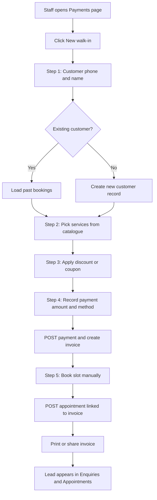
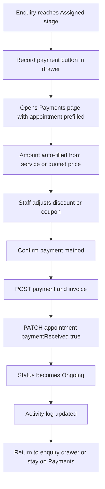
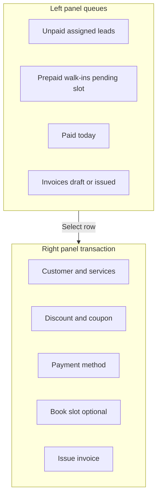
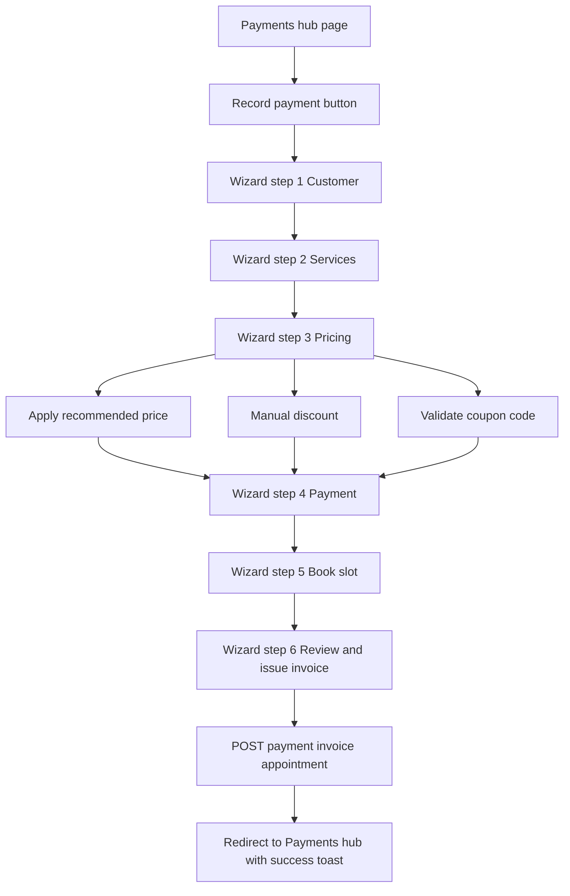
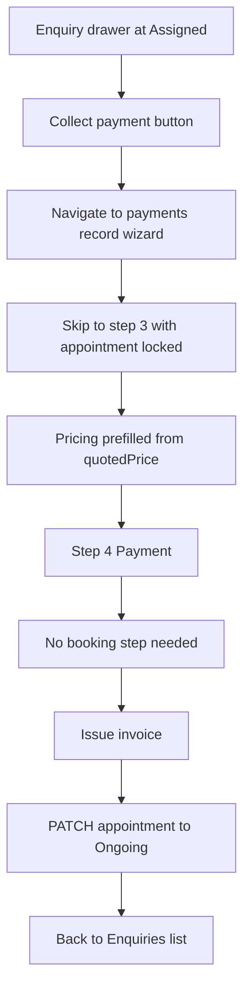
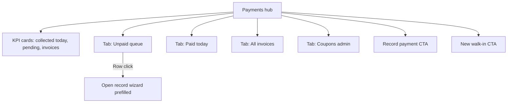
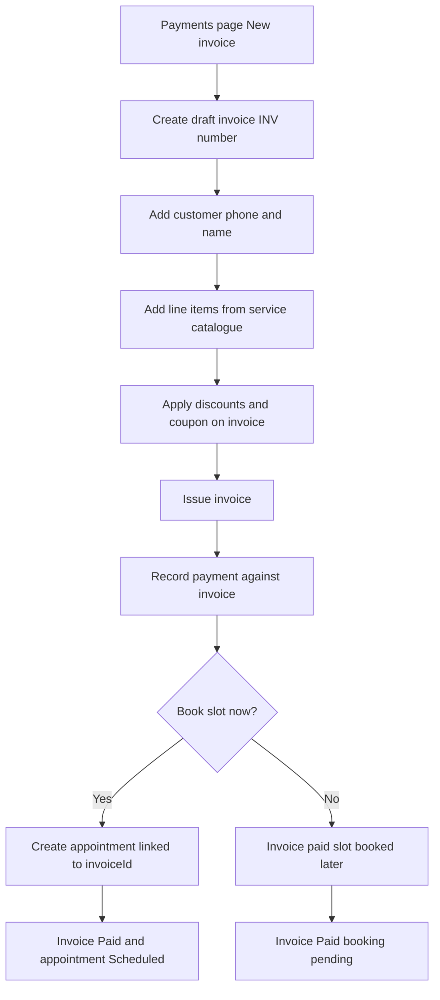
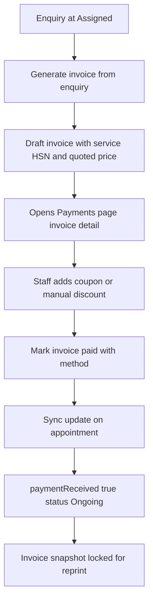
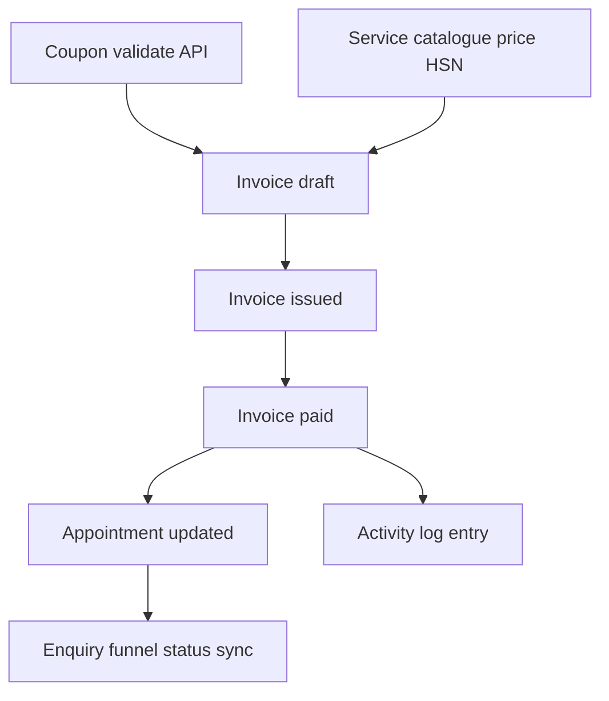

# MDW Wellness — Payment Hub Architecture Options

**Document purpose:** Help the client choose how payments, invoices, coupons, and walk-in bookings should work in the admin dashboard.

**Date:** June 2026  
**Status:** Proposal — not yet built

---

## Context — how it works today

| Area | Current behaviour |
|------|-------------------|
| Payment recording | Hidden inside the **Enquiry detail drawer** (section 4: amount, method, “Payment received” toggle) |
| Therapist view | Simple **“Payment collected”** checkbox in the appointment work checklist — no amount entry |
| Walk-in booking | Staff use **Book Slot**, **New Enquiry**, or **Customer drawer → Book new session** separately |
| Invoices | **Not built** |
| Coupons | **Not built** |
| Dedicated payment page | **Does not exist** |

**Important:** This is **not** an online payment gateway (Razorpay, Stripe, etc.). Staff manually record cash, UPI, card, or bank payments at the clinic.

---

## Requirements agreed

1. **Both payment paths**
   - **Prepaid walk-in** — customer pays first, then staff books the slot
   - **Post-assignment** — lead goes through the enquiry funnel until therapist is assigned, then payment is collected

2. **Full cash desk hub** — one area of the dashboard that handles:
   - Recording payments
   - Generating invoices
   - Applying discounts and coupon codes
   - Manual booking for walk-in customers

3. **Backend** — new API models needed in `WellnessBackend` (Invoice, Coupon, payment/invoice endpoints). The appointment record already has `paymentAmount`, `paymentMethod`, and `paymentReceived` fields.

---

## Quick comparison

| | Option A — Cash Desk | Option B — Hub + Wizard | Option C — Invoice-first |
|---|---|---|---|
| **Main routes** | 1 page | 2 pages (hub + wizard) | 1 page + invoice detail |
| **Walk-in speed** | Fastest | Medium | Medium |
| **Mobile / tablet** | Weaker | Strongest | Medium |
| **GST / audit trail** | Good | Good | Best |
| **Backend effort** | Medium | Medium | Highest |
| **Staff learning curve** | Low | Low | Medium |
| **Discount / coupon fit** | Good | Good | Best |
| **Best for** | Desktop front desk, all-day use | Phased rollout, mixed devices | Accounting-heavy clinics |

---

## Option A — Single Cash Desk page

### Summary

Add one sidebar item: **Payments** (or **Cash Desk**) at `/dashboard/payments`.

The page uses a **split layout**:
- **Left:** queues (unpaid assigned leads, prepaid walk-ins waiting for a slot, paid today, draft invoices)
- **Right:** active transaction panel (customer, services, discount/coupon, payment, optional booking, issue invoice)

Enquiry and appointment drawers link here with `?appointmentId=` so post-assignment payments open pre-filled.

### Walk-in flow (pay first, then book)



### Post-assignment flow (from enquiry funnel)



### Page layout



### Pros

- **Fastest for daily front-desk use** — one screen open all day, no page changes between customers
- **Queue-driven** — staff always see who needs payment or a slot at a glance
- **Minimal navigation** — walk-in and post-assignment both happen in the same place
- **Lower training burden** — “everything money-related lives on Payments”
- **Medium backend complexity** — payment + invoice + appointment link, but not as rigid as a full ledger

### Cons

- **Crowded on small screens** — split layout is hard on phones and small tablets
- **Harder to build as phased releases** — the whole page needs to feel complete before launch
- **Weaker separation of concerns** — payment, booking, and invoicing are tightly coupled in one UI
- **Audit trail is good but not best** — payment and invoice are created together, less flexible for “invoice first, pay later” edge cases

### Best suited when

- Clinic has a **fixed reception desk** with a desktop or large tablet
- Staff handle **high walk-in volume** and need speed over structure
- Client wants **one obvious place** for all cash handling

---

## Option B — Hub list + dedicated Record wizard

### Summary

Two routes:
- **`/dashboard/payments`** — hub with KPIs, tabs (Unpaid queue, Paid today, All invoices, Coupons), and CTAs
- **`/dashboard/payments/record`** — full-screen **multi-step wizard** for each transaction

Enquiry drawer **“Collect payment”** and Customer drawer **“New walk-in”** deep-link into the wizard with context pre-filled (skips early steps when possible).

### Walk-in wizard



### Post-assignment shortcut



### Hub page structure



### Pros

- **Clearest user journey** — one step at a time, hard to skip required fields
- **Best for mobile and tablet** — wizard is full-screen, touch-friendly
- **Easiest phased rollout** — ship hub + steps 1–4 first, add booking and coupons later
- **Clean URLs** — shareable links (`/payments/record?appointmentId=…`) for support and training
- **Matches existing app patterns** — similar to enquiry intake modal and multi-section drawers
- **Medium backend complexity** — same APIs as Option A, simpler frontend state per step

### Cons

- **Extra click to start** — not as fast as Option A for repeat walk-ins
- **More navigation** — staff move between hub and wizard
- **Wizard fatigue** — 6 steps may feel long for simple “quick pay” cases unless we add shortcuts
- **Two routes to maintain** — slightly more frontend code than a single page

### Best suited when

- Staff use **mixed devices** (phone, tablet, desktop)
- Client wants to **ship in phases** (payments first, coupons and booking next)
- **Training and clarity** matter more than absolute speed
- **Recommended default** for most clinics balancing speed and maintainability

---

## Option C — Invoice-first ledger

### Summary

The **Invoice** is the primary record. Payment means marking an invoice **paid**.

- Walk-in: create **draft invoice** → add line items → apply discount/coupon → issue → record payment → optionally book slot linked to `invoiceId`
- Post-assignment: enquiry at Assigned → **“Generate invoice”** → draft pre-filled from service/HSN/`quotedPrice` → pay on Payments page → appointment syncs to Ongoing

### Walk-in flow (invoice-first)



### Post-assignment flow (invoice from enquiry)



### Data model flow



### Pros

- **Strongest audit trail** — every rupee tied to an invoice number (`INV-0001`, etc.)
- **Best for GST / HSN / SAC compliance** — line items, tax, and totals frozen on issue
- **Discount and coupon logic lives in one place** — on invoice lines, not scattered across drawers
- **Reprint and disputes are easy** — invoice is an immutable snapshot after issue
- **Supports “invoice now, pay later”** — draft → issued → paid can be separate steps
- **Natural fit for accountant exports** — invoice list is the books

### Cons

- **Highest backend effort** — Invoice model, states, line items, coupon engine, appointment sync
- **Staff must learn invoice-first thinking** — “create invoice” before “take money”
- **Slower for simple walk-ins** — more steps than Option A for a quick cash payment
- **Enquiry drawer changes** — payment section may be replaced or reduced to “Generate invoice → go to Payments”
- **Longer time to first release**

### Best suited when

- Client needs **proper invoicing** for accounts, GST filings, or insurance
- **Coupon campaigns** and **manual discounts** are core to the business model
- **Audit and reprint** matter as much as booking speed
- Clinic is willing to invest more upfront for long-term financial clarity

---

## Shared backend (all options)

New endpoints in `WellnessBackend` (none exist today):

| Endpoint | Purpose |
|----------|---------|
| `POST api invoices` | Create invoice (draft or issued) |
| `GET api invoices` | List / filter by date, status, phone |
| `GET api invoices by id` | Detail for reprint |
| `PATCH api invoices by id` | Update status, mark paid, void |
| `POST api coupons validate` | Check code and return discount amount |
| `GET api coupons` | Admin list (Settings or Payments tab) |
| `POST api coupons` | Create coupon (admin) |

Option A and B may also use `POST api payments` as a thin wrapper; Option C folds payment into `PATCH invoice → paid`.

**Appointment sync (all options):** When payment is recorded, update the linked appointment:

- `paymentReceived: true`
- `paymentAmount`, `paymentMethod`, `paymentReceivedAt`
- `status: "ongoing"` (post-assignment path)
- New `activityLog` entry

---

## What changes in the existing dashboard (all options)

| Current | After payment hub |
|---------|-----------------|
| Payment section in Enquiry drawer | Stays as shortcut **or** replaced by “Open in Payments” link |
| Therapist “Payment collected” checkbox | Links to Payments with amount entry, or syncs from hub |
| Book Slot page | Still exists; walk-ins can also book from Payments hub |
| Customers page | “Generate invoice” per booking row |
| Sidebar | New **Payments** icon (admin/staff; therapists likely read-only or hidden) |

---

## Recommendation for client discussion

| Priority | Suggested option |
|----------|------------------|
| Speed at front desk, desktop only | **Option A** |
| Balanced — phased build, mobile-friendly, clear UX | **Option B** (recommended) |
| GST, invoices, coupons, audit trail first | **Option C** |

---

## Client decision

**Selected option:** _[ ] A — Cash Desk &nbsp;&nbsp; [ ] B — Hub + Wizard &nbsp;&nbsp; [ ] C — Invoice-first_

**Notes / constraints:**

```
(Client fills in here)
```

**Sign-off:**

| Role | Name | Date |
|------|------|------|
| Client | | |
| Product / Dev | | |

---

## Related documents

- [Dashboard flowcharts](./dashboard-flowchart.md) — full app flows (GitHub-safe Mermaid)
- [Operator checklist](../operator.md) — deploy and env steps
- Plan file: payment hub implementation todos in Cursor plan `repo_status_and_next_steps`
