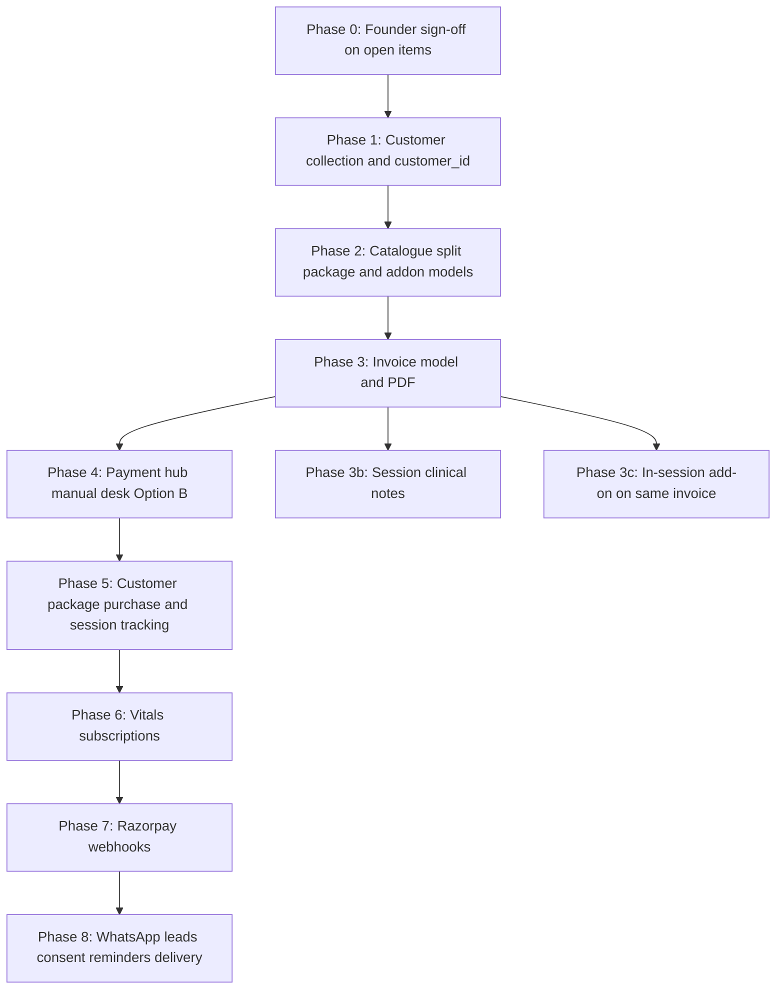

# MDW Wellness — Gap Analysis (Phase 1)

**Source document:** [`mdw_business_flow.md`](./mdw_business_flow.md)  
**Assessed against:** `WellnessFrontend` (Next.js dashboard) + `WellnessBackend` (Render API + MongoDB)  
**Date:** June 2026  
**Phase:** 1 — Gap analysis only. No source code was modified.

---

## Executive summary

The current system is a **lead-to-appointment operations dashboard** with a **unified service catalogue**, **manual payment logging**, and a **therapy enquiry funnel**. It does **not** yet implement the business plan’s core commercial layers: Vitals subscriptions, therapy package purchases with session tracking, add-on consent via WhatsApp, structured clinical session records, typed invoices/PDFs, Razorpay, or a permanent customer identity model.

| Area | Overall status | Biggest gap |
|------|----------------|-------------|
| Vitals subscriptions | **No** | No subscription entity, plans, renewal, or reminders |
| Therapy packages | **Partial** | Catalogue metadata only; no purchase or validity tracking |
| Add-ons | **Partial** | Recommends a new booking; no same-invoice or WhatsApp consent |
| Session notes | **No** | Only free-text `note` + operational checklist |
| Enquiry & booking | **Partial** | Funnel works; WhatsApp capture and plan-specific fields missing |
| Customer identity | **Partial** | Phone grouping vs permanent `customer_id` |
| Invoicing | **No** | No invoice model, types, PDF, or WhatsApp delivery |
| Payments | **Partial** | Manual desk recording only; no gateway or scenario rules |
| Catalogue split | **Partial** | One `Service` table instead of package + add-on catalogues |

**Estimated overall build:** Large — roughly **60–70% of the business plan is net-new**, not refinement of existing code.

---

## 1. Vitals service

| Feature (from plan) | Implemented? | Where in codebase | Notes / discrepancies |
|---------------------|--------------|-------------------|------------------------|
| Three fixed Vitals plans (₹99 / ₹149 / ₹499) | **No** | — | No vitals-specific pricing or plan catalogue |
| Vitals as separate service line from Therapy | **Partial** | `schema.ts` `service`, `vitals[]`; enquiry drawer labels | Display hints only; not separate booking/billing logic |
| Advance payment before visit scheduled | **Partial** | `enquiry-detail-drawer.tsx` payment section | Payment is recorded **after** physio assignment; slots can be set earlier — **opposite order** from plan |
| Manual renewal (not auto-charge) | **No** | — | — |
| WhatsApp reminders 5 days and 1 day before expiry | **No** | — | No cron, jobs, or notification integration |
| Missed visit lapses, no carry-forward | **No** | — | — |
| One free reschedule with 24hr notice | **No** | — | — |
| Plan change keeps same customer (not new record) | **Partial** | `customer.ts` groups by phone | No subscription history; identity is implicit phone key |
| Vitals package metadata (weeks/months) | **Partial** | `serviceModel.ts`, `service-form-fields.tsx` | `isPackage`, `packageUnit: weeks\|months`, `packageCount` on **Service** — catalogue only, not linked to purchases |

---

## 2. Therapy service

| Feature (from plan) | Implemented? | Where in codebase | Notes / discrepancies |
|---------------------|--------------|-------------------|------------------------|
| Online consultation entry (₹500 advance) | **Partial** | `consultantform.tsx`, `typeOfappointment: consultation` | Books slot; **no ₹500 price gate or advance payment** |
| Direct home visit therapy entry | **Partial** | `appointmentbookingform.tsx`, `service: Home Therapy` | Booking exists; not tied to package purchase |
| Dynamic `package_catalogue` (admin CRUD, no code deploy) | **Partial** | `ServicesPage`, `/api/services`, `serviceModel.ts` | Single **Service** collection with `isPackage` flag — not separate `package_catalogue` |
| `therapy_type`, `validity_days`, `price_per_session`, `status: active\|retired` | **No** | — | Only `category` string; hard **delete**, no retire |
| Full package payment upfront before session 1 | **Partial** | Enquiry funnel payment toggle | Manual amount entry; not tied to package purchase record |
| Package purchase generates Package Purchase Invoice | **No** | — | — |
| Session count tracking (e.g. session 3 of 8) | **No** | — | No `customer_packages[]` |
| Validity window and session lapse rules | **No** | — | — |
| Reschedule policy (24hr notice, one allowed) | **No** | — | — |
| Therapist = independent practitioner; invoice from MDW | **Partial** | Therapist roster + payment on appointment | No invoice issued from MDW yet |
| Therapist payout / commission tracking | **No** | — | **Open item** per plan — correctly unbuilt |

---

## 3. Mid-session add-on therapies

| Feature (from plan) | Implemented? | Where in codebase | Notes / discrepancies |
|---------------------|--------------|-------------------|------------------------|
| Separate `addon_catalogue` (admin-managed, no free text) | **No** | Same `Service` collection | `price` + `recommendedPrice` approximate standalone vs discounted |
| `duration_minutes` on add-ons | **No** | — | — |
| Therapist selects add-on from catalogue | **Partial** | `recommend-service.tsx` | Picks from services list |
| In-session path: same invoice, discounted `recommended_price` | **No** | — | Creates **new** appointment (`appointmentKind: recommended`) instead |
| Standalone add-on: separate invoice, full price, advance | **No** | — | Recommend flow books another appointment, no invoice |
| WhatsApp YES/NO consent with timestamp | **No** | — | — |
| `addon_recommendation` structured audit record | **No** | — | Only `recommendedFrom`, `quotedPrice` on child appointment |
| Post-payment timing (end of visit vs within 24hrs) | **No** | — | — |

---

## 4. Session notes (clinical history)

| Feature (from plan) | Implemented? | Where in codebase | Notes / discrepancies |
|---------------------|--------------|-------------------|------------------------|
| `session_record` model | **No** | — | — |
| `chief_complaint`, `therapist_observations`, `treatment_given[]` | **No** | — | — |
| `progress_rating` (1–5) | **No** | — | — |
| `addons_recommended[]`, `addons_accepted[]` | **No** | — | — |
| `next_session_notes` | **No** | — | — |
| Generic session note | **Partial** | `note` on `enquirySchema` | Medical/general text, not structured clinical |
| Operational checklist | **Partial** | `work-checklist.tsx` | arrived / performed / payment / completed — not clinical |

---

## 5. Enquiry and booking flow

| Feature (from plan) | Implemented? | Where in codebase | Notes / discrepancies |
|---------------------|--------------|-------------------|------------------------|
| WhatsApp button click recorded (zero-message lead) | **No** | — | Would need public site + backend webhook; not in this dashboard |
| Executive manual follow-up | **Yes** | `EnquiriesPage`, `enquiry-detail-drawer.tsx` | — |
| Path: direct home visit vs online consult first | **Partial** | `typeOfappointment`, `service` fields | Not `path_chosen` enum from plan |
| Executive checks therapist availability | **Partial** | Physio slot + `physioAssignmentConfirmed` | Consult and physio slots separate |
| Therapist allocation | **Yes** | `doctorId`, `doctor` in drawer | — |
| `enquiry_id` | **Yes** | `enquiryId` (ENQ-####) | Backend counter in `lib/counters.ts` |
| `query_source` (whatsapp_button, direct_call, referral) | **No** | `source` on backend | Values: `public_booking_form`, `dashboard` only |
| `query_message` | **Partial** | `note` | Not distinguished from executive notes |
| `path_chosen` | **No** | — | — |
| `preferred_datetime` | **Partial** | `preferredReachOutTime`, `consultationSlot`, `physioSlot` | Split across multiple fields |
| `therapist_availability_confirmed` | **Yes** | `physioAssignmentConfirmed` | Renamed but same intent |
| `executive_id` | **Partial** | `reachedOutBy`, `assignedTo` | `assignedTo` in schema; UI mainly uses `reachedOutBy` |
| Status: new / contacted / scheduled / converted / dropped | **Partial** | `status` + funnel booleans | Backend: enquiry / scheduled / ongoing / completed / cancelled |
| `drop_reason` for analytics | **No** | `statusNote` on cancel only | Cancellation reason, not structured drop |
| Duplicate-phone guard on open leads | **Yes** | `enquiry-intake-modal.tsx`, `findOpenEnquiryByPhone` | — |
| Follow-ups for unreachable leads | **Yes** | `FollowUpsPage`, `reachAttempts` | Beyond original plan — useful addition |
| Activity log | **Partial** | `activityLog[]` on schema + drawer | Backend model has field; patch docs note possible silent drops on older deploys |

---

## 6. Customer identity model

| Feature (from plan) | Implemented? | Where in codebase | Notes / discrepancies |
|---------------------|--------------|-------------------|------------------------|
| Permanent `customer_id` per person | **No** | — | **Conflict:** identity = `phonenumber` |
| `subscriptions[]` (Vitals history) | **No** | — | — |
| `customer_packages[]` (Therapy history) | **No** | — | — |
| Active plan/package by query not overwrite | **No** | — | — |
| Customers page with booking history | **Partial** | `CustomersPage`, `deriveCustomers()` | Client-side aggregate from appointments |
| Segment pills (New / Returning / VIP) | **Yes** | `customer.ts`, `customers-columns.tsx` | Extra feature not in business plan |
| Same person two phones = two customers | **Yes** (current behaviour) | Phone grouping | Plan expects one `customer_id` regardless |

**Conflict:** Plan Section 5 requires a persisted **Customer** collection referenced by all child records. Current architecture stores patient data **on each appointment** and derives customers in the frontend.

---

## 7. Invoicing

| Feature (from plan) | Implemented? | Where in codebase | Notes / discrepancies |
|---------------------|--------------|-------------------|------------------------|
| Invoice type: `vitals_subscription` | **No** | — | — |
| Invoice type: `package_purchase` | **No** | — | — |
| Invoice type: `therapy_session` | **No** | — | — |
| Invoice type: `therapy_addon_standalone` | **No** | — | — |
| Invoice type: `online_consultation` | **No** | — | — |
| Session invoice line-item breakdown | **No** | — | — |
| Package-covered lines at ₹0 + add-on lines at discounted rate | **No** | — | — |
| Struck-through market price on covered services | **No** | — | **Open item** — founder undecided |
| One invoice per appointment/session ID | **No** | — | Planned in `payment-hub-options.md` only |
| PDF generation | **No** | — | PDF viewing exists for therapist **certificates** only |
| WhatsApp delivery via wa.me + hosted PDF (R2) | **No** | — | — |
| HSN/SAC on catalogue | **Partial** | `hsnCode` on `Service` | Prep for GST; no invoice uses it yet |

---

## 8. Payments

| Feature (from plan) | Implemented? | Where in codebase | Notes / discrepancies |
|---------------------|--------------|-------------------|------------------------|
| Razorpay (or any payment gateway) | **No** | — | Plan and code agree: not implemented |
| Manual payment recording (cash, UPI, card, bank) | **Yes** | `enquiry-detail-drawer.tsx` | amount, method, `paymentReceived` toggle |
| Therapist payment checkbox | **Partial** | `work-checklist.tsx` | No amount; not synced with enquiry payment |
| Dedicated Payments / cash desk page | **No** | — | Proposed in `docs/payment-hub-options.md` |
| Vitals: always advance before scheduling | **No** | — | — |
| Online consult: ₹500 advance | **No** | — | — |
| First home visit: advance | **No** | — | Current funnel: pay after assignment |
| Package purchase: full advance | **No** | — | — |
| In-session add-on: post-pay (visit end / 24hr) | **No** | — | — |
| Standalone add-on: advance | **No** | — | — |
| Webhook → paid → invoice → WhatsApp | **No** | — | — |
| Coupon codes | **No** | — | Discussed in payment hub doc only |

**Current reality:** Staff manually record payment at the desk. No automation, no gateway, no scenario-specific rules engine.

---

## 9. Catalogue architecture

| Plan concept | Current implementation | Status |
|--------------|------------------------|--------|
| `package_catalogue` (therapy packages) | `services` with `isPackage: true` | **Partial** |
| `addon_catalogue` (mid-session therapies) | Same `services` + `recommendedPrice` | **Partial** |
| Per-therapy-type package sets | `category` free string | **Partial** |
| Retire package (`status: retired`) | Hard delete | **No** |
| Admin CRUD without code deploy | `/dashboard/services` + `/api/services` | **Yes** |
| Vitals plans as catalogue entries | `packageUnit: weeks\|months` possible | **Partial** — not wired to subscriptions |

**Conflict:** Plan requires **three distinct catalogues** (packages, add-ons, and implicit service line items). Code has **one unified Service model**.

---

## Features not implemented — feasibility and effort

| Feature not implemented | Feasibility | Reason | Suggested approach | Estimated effort |
|-------------------------|-------------|--------|-------------------|------------------|
| Vitals subscription entity + 3 plans | **Medium** | Needs new Customer + Subscription collections, renewal dates, visit scheduling rules | New `Subscription` model; link to `customer_id`; admin UI for plan assignment; block scheduling until paid | **2–3 weeks** |
| WhatsApp renewal reminders (5d, 1d) | **Hard** | Requires WhatsApp Business API or third-party (e.g. Interakt, WATI) + cron on Render | Job scheduler + template messages + subscription expiry query | **1–2 weeks** (after API vendor chosen) |
| WhatsApp button click lead capture | **Medium** | Lives on public site + backend, not dashboard | Pixel/webhook on mdw-wellness WhatsApp CTA → `POST` lead with `query_source: whatsapp_button` | **3–5 days** |
| Permanent `customer_id` + Customer collection | **Medium** | Breaks current phone-only grouping; migration needed | New `Customer` model; backfill from appointments; update all creates to reference `customer_id` | **1–2 weeks** |
| `package_catalogue` split from services | **Easy–Medium** | Extend Service or new collection with `validity_days`, `status`, `therapy_type` | Either extend `serviceModel` or add `Package` collection; migrate existing services | **3–5 days** |
| `addon_catalogue` split | **Easy–Medium** | Same as above | New `Addon` collection or `serviceType` discriminator on Service | **3–5 days** |
| Customer package purchase + session tracking | **Hard** | Core commercial logic: purchase, deduct sessions, validity, lapse | `CustomerPackage` model: customerId, packageId, sessionsUsed, purchasedAt, validUntil, status | **2–3 weeks** |
| Add-on WhatsApp consent flow | **Hard** | WhatsApp two-way + webhook to update `addon_recommendation` | Therapist taps Recommend → outbound WA template → inbound webhook → update record | **2 weeks** |
| Same-invoice in-session add-on | **Medium** | Conflicts with current “book new appointment” pattern | Add line items to session invoice instead of `recommend-service` booking new row | **1 week** (after invoices exist) |
| `session_record` clinical notes | **Medium** | New model + therapist UI in appointment drawer | `SessionRecord` linked to appointmentId; form in drawer post-checklist | **1 week** |
| Invoice types + PDF generation | **Medium–Hard** | No PDF lib or storage today | `Invoice` model + line items; `@react-pdf` or Puppeteer; store on R2; INV-#### counter | **2–3 weeks** |
| WhatsApp invoice delivery (wa.me) | **Easy** (after PDF) | Just URL encoding once PDF is hosted | Generate wa.me link with PDF URL in admin UI | **2–3 days** |
| Razorpay integration | **Medium** | Clean Render Express structure; no gateway code yet | Orders API for sessions/packages; webhooks to mark paid; payment links in booking flow | **2–3 weeks** |
| Payment hub page (Options A/B/C) | **Medium** | Frontend-only shell possible; needs invoice APIs | See `docs/payment-hub-options.md`; recommend Option B phased | **2–3 weeks** (full hub) |
| Scenario-based advance/post-pay rules engine | **Hard** | Many business rules across Vitals/Therapy/add-ons | Rules table or state machine on booking type + customer history | **2 weeks** (after customer + package models) |
| GST line items on invoices | **Medium** | HSN exists on services; GST registration status unknown | Add tax fields to invoice; **blocked on founder input** | **3–5 days** (after GST decision) |
| Therapist payout tracking | **Hard** | Undefined business rules | Flag only — do not build until founder defines commission model | **TBD** |

---

## Conflicts between plan and existing code

| # | Conflict | Plan says | Code does | Risk |
|---|----------|-----------|-----------|------|
| 1 | Customer identity | One permanent `customer_id` | Group appointments by `phonenumber` | Duplicate customers, no subscription history |
| 2 | Payment timing (therapy) | Advance before first visit / package | Pay after physio assignment in funnel | Cash flow and no-show exposure |
| 3 | Payment timing (vitals) | Advance before any visit scheduled | No vitals flow; generic appointment booking | Vitals cannot go live without new flow |
| 4 | Add-on in session | Same invoice, discounted line item | New recommended appointment record | Double bookings, no single visit invoice |
| 5 | Catalogue structure | `package_catalogue` + `addon_catalogue` | Unified `Service` model | Reporting and pricing rules conflated |
| 6 | Enquiry status enum | new / contacted / converted / dropped | enquiry / scheduled / ongoing / completed / cancelled | Analytics and automations won't align |
| 7 | Query source | whatsapp_button / direct_call / referral | public_booking_form / dashboard | Cannot measure WhatsApp funnel |
| 8 | Package metadata | validity_days, price_per_session, retired status | packageCount, price only | Cannot enforce package expiry |
| 9 | Invoice architecture | Per-session PDF, 5 invoice types | Payment fields on appointment only | No legal/commercial document trail |
| 10 | Service line separation | Vitals and Therapy must not merge logic | Shared appointment collection and funnel | Vitals subscription rules will pollute therapy funnel |

---

## Technical constraints

| Constraint | Impact |
|------------|--------|
| **Single `appointmentbookings` collection** for enquiries, appointments, funnel, and payments | Adding subscriptions, packages, and invoices requires either heavy embedding or new collections with foreign keys |
| **No Customer collection in MongoDB** | Every plan feature referencing `customer_id` needs a migration foundation first |
| **No payment gateway** | All “advance payment before X” rules are unenforceable until Razorpay (or manual desk hub with strict UI gates) |
| **No WhatsApp backend** | Lead capture, add-on consent, renewal reminders, and invoice delivery all blocked |
| **No PDF / object storage pipeline** | Invoices cannot be delivered until R2/S3 + generator exists |
| **No job scheduler on Render** | Renewal reminders need cron (Render cron job, or external scheduler) |
| **Mongoose silent field drop** | Extended fields only persist if backend model matches; patch docs in `scripts/` should be verified on live deploy |
| **Public site not in this repo** | WhatsApp click tracking and public vitals purchase live on mdw-wellness, not WellnessFrontend |
| **Therapist role scoped nav** | Payments hub and invoice tools need explicit role rules (therapists likely read-only or excluded) |
| **GST registration unknown** | Invoice tax lines cannot be finalized |

---

## Open items — pending founder input (from plan Section 8)

These must **not** be assumed in implementation:

| # | Open item | Impact if assumed incorrectly |
|---|-----------|-------------------------------|
| 1 | Refunds and cancellations (unused package sessions, mid-cycle Vitals cancel) | Wrong refund logic, legal exposure |
| 2 | GST / tax on invoices | Wrong invoice format, compliance risk |
| 3 | Switching therapist mid-package | No workflow for reassignment |
| 4 | Therapist payouts / commission | Cannot build payout reports |
| 5 | Package validity expiry — refund or grace period | Customer disputes |
| 6 | Struck-through pricing on covered session lines | Cosmetic invoice decision |
| 7 | Final package sizes, pricing, full add-on catalogue | Over-hardcoding if built before confirmation |
| 8 | No-show / cancellation policy enforcement | Product vs legal T&Cs mismatch |

---

## What is already built (foundation to keep)

These align with or extend the business plan and should be preserved:

- Enquiry funnel with stepper, stale highlights, duplicate-phone guard
- Executive reach-out, consult slot, physio slot, therapist assignment checkpoints
- Manual payment recording (amount + method) with Ongoing/Completed gating
- Service catalogue admin with `recommendedPrice`, `isPackage`, HSN
- Therapist recommend-service flow (needs redesign for same-invoice model)
- Customers page (needs upgrade to real `customer_id`)
- Follow-ups page for unreachable leads
- Therapist roster, role-scoped nav, work checklist, activity log
- Public booking intake via `POST /api/appointments/public`

---

## Recommended implementation sequence

Based on dependencies and feasibility:

| Phase | Deliverable | Depends on |
|-------|-------------|------------|
| 0 | Founder answers on GST, refunds, no-show, catalogue pricing | — |
| 1 | `Customer` model + migration from phone groups | Phase 0 |
| 2 | Package and add-on catalogue fields or collections | Phase 1 |
| 3 | Invoice types, line items, PDF, INV-#### | Phase 2 |
| 4 | `/dashboard/payments` hub (manual, no gateway) | Phase 3 |
| 5 | `CustomerPackage` + session deduction | Phase 3, 4 |
| 6 | Vitals subscriptions + renewal dates | Phase 1, 5 |
| 7 | Razorpay orders + webhooks | Phase 3 |
| 8 | WhatsApp Business API integration | Phase 6, 7 |
| 3b | `session_record` clinical form in appointment drawer | Phase 1 |
| 3c | Redesign recommend-service → invoice line item | Phase 3 |

---

## Alignment with existing proposals

| Document | Relationship to this gap analysis |
|----------|-----------------------------------|
| [`docs/payment-hub-options.md`](./docs/payment-hub-options.md) | Covers **Phase 4** manual payment desk — aligns with plan Section 7 manual path; does not replace Razorpay or subscription logic |
| [`docs/dashboard-flowchart.md`](./docs/dashboard-flowchart.md) | Documents **current** flows; Section 12 “Planned invoice flow” matches Phase 3 |
| [`scripts/*_BACKEND_PATCH.md`](../scripts/) | Partial backend fields; gap analysis confirms full commercial models still missing |

---

## Phase 2 gate

**Do not begin implementation** until:

1. Founder reviews this gap analysis  
2. Open items in Section 8 are answered or explicitly deferred  
3. Client selects payment hub option (A / B / C) from `payment-hub-options.md`  
4. Phase 0 priority is agreed (Customer + Invoice first vs Vitals first)

---

*End of gap analysis. Source: `mdw_business_flow.md` Phase 1 instructions.*
