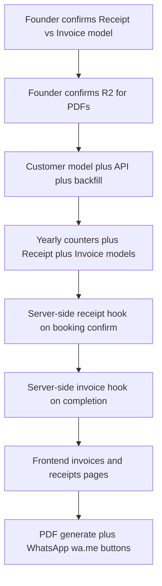

# Invoice MVP — Conflict Analysis (updated after `02_resolution.md`)

**Canonical spec:** [`mdw-invoice-mvp-spec.md`](./mdw-invoice-mvp-spec.md)  \n+**Inputs:** [`discussion.md`](./discussion.md), [`02_resolution.md`](./02_resolution.md), [`gap-analysis.md`](./gap-analysis.md)  \n+**Cross-checked against:** `WellnessFrontend`, `WellnessBackend`  \n+**Date:** June 2026  \n+**Phase:** Conflict review — update before implementation

---

## Summary

The MVP direction is now clarified by `02_resolution.md`:

- **Receipt model is removed** (no `/dashboard/receipts`, no `related_receipt_id`, no `RCT-*` counters)
- Advance payment proof at booking time is a **manual WhatsApp text template** (no PDF, no DB doc)
- Invoice PDFs are stored in **Cloudflare R2** (UploadThing remains for therapist media)
- Invoice generation is **server-side and idempotent**, keyed by `appointment_id`

### Resolved by founder decisions (no longer blockers)

- Former Conflict #5 (Receipt trigger UX) — **Removed** (no Receipt)
- Former Conflict #8 (Receipt vs Invoice one-vs-two) — **Resolved** (Invoice only)
- Former Conflict #13 (PDF hosting ambiguity) — **Resolved** (R2 confirmed; do not touch UploadThing)
- Former Conflict #6 (two completion triggers causing duplicates) — **Resolved direction** (server-side idempotent generation)
- Former Conflict #14 (missing appointment linkage) — **Resolved direction** (add `appointment_id` + optional `enquiry_id`)

### Still blocking before implementation

| # | Conflict | Severity | Recommended resolution |
|---|----------|----------|----------------------|
| 1 | No persisted Customer model | **Blocker** | Option A — new `Customer` collection + backfill |
| 2 | No Invoice backend | **Blocker** | Option A — new model, routes, controllers |
| 3 | Counter pattern lacks yearly reset | **High** | Option A — year-keyed counters |
| 4 | Customer identity = phone on appointments | **Blocker** | Option A — add `customer_id` FK + migration |
| 7 | Auto-generation hooks only on frontend PATCH | **High** | Option A — backend hooks in appointment update |
| 9 | No “Orders” page UI pattern in repo | **Medium** | Option B — adapt Customers drawer pattern |
| 10 | Package source: Service vs package_catalogue | **Medium** | Option A — reuse `Service` with Therapy filter |
| 11 | Vitals entries in Service catalogue | **Medium** | Option B — filter `packageUnit: sessions` only |
| 12 | Add-ons via recommend-service vs invoice line items | **Medium** | Option B — line items at invoice time; flag recommend flow |
| 15 | Duplicate payment state (appointment vs invoice) | **Medium** | Option B — appointment = source; invoice mirrors |
| 17 | Customers page vs Customer API | **Medium** | Option B — keep page; switch data source |
| 18 | Manual invoice fallback removed | **Low** | Option B — add admin-only manual create later |
| 19 | payment-hub-options.md vs this spec | **Low** | Superseded for MVP — invoices/receipts pages instead |
| 20 | Therapist nav / permissions | **Low** | Option A — staff/admin only for invoices |

---

## Conflict #1 — No persisted Customer model (BLOCKER)

### What the spec says
- Permanent `Customer` collection with `customer_id` (`CUST-0001`, no yearly reset).
- Receipt and Invoice both require stable `customer_id` FK.
- Search-select by name or ID during booking confirmation.

### What the codebase has
- **No** `Customer` model in WellnessBackend (`models/` has only: `appointmentsBookingModel`, `serviceModel`, `userModel`, `doctorsModel`).
- **Frontend** derives customers client-side from appointments grouped by `phonenumber`:

```8:26:c:\workspace\backend-mdw\WellnessFrontend\src\data\customer\customer.ts
/**
 * A customer is derived client-side from the appointments collection by
 * grouping records by phonenumber. The MOST RECENT name/email/location
 * for that phone wins for display purposes.
 */
export interface Customer {
  phonenumber: number;
  name: string;
  ...
}
```

- Backend docs (`WellnessBackend/docs/models.md`) state patients are **not** users; contact info lives on `AppointmentBooking`.

### Resolution options

| Option | Approach | Pros | Cons |
|--------|----------|------|------|
| **A (recommended)** | Add `Customer` Mongoose model + `/api/customers` CRUD. Backfill from unique phones on existing appointments. Add `customer_id` to new appointments going forward. | Matches spec; stable FK for receipts/invoices | Migration script needed; Customers page must be rewired |
| **B** | Use `phonenumber` as pseudo-ID; format display as `CUST-{phone}` without new collection | Faster | Not sequential CUST-0001; breaks spec; phone changes orphan history |
| **C** | Embed `customer_id` only on Receipt/Invoice; still derive from phone elsewhere | Smaller schema | Two truths for identity; doesn't fix booking search-select |

**Recommendation:** **Option A.** This is the highest-priority dependency for the entire MVP.

---

## Conflict #2 — No Receipt or Invoice backend (BLOCKER)

### What the spec says
- `Receipt` model (`RCT-YYYY-0001`) — auto at booking + advance payment.
- `Invoice` model (`INV-YYYY-0001`) — auto at session completion; editable.
- List/detail APIs, PDF URL field, `related_receipt_id` on invoice.

### What the codebase has
- **Zero** invoice/receipt models, routes, or controllers in WellnessBackend.
- `server.ts` mounts only: `/api/appointments`, `/api/services`, `/api/users`, `/api/therapist`, `/api/metrics`.
- Frontend has **no** `actions/invoices/` or `actions/receipts/`.
- [`gap-analysis.md`](./gap-analysis.md) and [`payment-hub-options.md`](./docs/payment-hub-options.md) document invoices as **not built**.

### Resolution options

| Option | Approach | Pros | Cons |
|--------|----------|------|------|
| **A (recommended)** | New `receiptModel.ts`, `invoiceModel.ts`, controllers, routes (`/api/receipts`, `/api/invoices`). Generation logic in appointment update hooks or dedicated service module. | Clean separation; matches spec | Largest net-new backend work |
| **B** | Store receipts/invoices as subdocuments on `AppointmentBooking` | Fewer collections | Harder to list/edit globally; violates “single source of truth” edit requirement |
| **C** | Frontend-only documents in session storage | None for production | Unacceptable for MVP |

**Recommendation:** **Option A.**

---

## Conflict #3 — Counter pattern: flat vs yearly reset (HIGH)

### What the spec says
- `RCT-2026-0001`, `INV-2026-0001` — **reset sequence each calendar year**.
- Extend existing `lib/counters.ts` pattern with year-keyed counter docs.

### What the codebase has

```10:18:c:\workspace\WellnessBackend\lib\counters.ts
export async function nextSequence(name: string): Promise<number> {
    const counters = mongoose.connection.collection("counters");
    const result = await counters.findOneAndUpdate(
        { _id: name } as any,
        { $inc: { seq: 1 } },
        { upsert: true, returnDocument: "after" }
    );
    return result?.seq ?? 1;
}
```

- Used as flat keys: `"enquiry"` → `ENQ-0001`, `"service"` → `SRV-0001`, `"therapist"` → `THR-0001`.
- **No yearly reset** anywhere.

### Resolution options

| Option | Approach | Pros | Cons |
|--------|----------|------|------|
| **A (recommended)** | Add `nextYearlySequence(type: "invoice" \| "receipt", year: number)` with `_id: "invoice-2026"`. Format `INV-${year}-${pad4(seq)}`. | Matches spec exactly | Small refactor to counters helper |
| **B** | Flat global counter; embed year in prefix only (`INV-2026-0089` where 0089 is global #89) | Minimal code change | **Contradicts** “resets each year” requirement |
| **C** | Use UUIDs for internal ID; display number generated separately | No collision risk | Loses human-friendly sequential IDs |

**Recommendation:** **Option A.**

---

## Conflict #4 — Customer identity on appointments (BLOCKER)

### What the spec says
- All receipts, invoices, subscriptions (future), packages (future) reference `customer_id`.
- One person = one `customer_id` even if plan changes.

### What the codebase has
- Appointments store `name`, `phonenumber`, `email`, `location` **inline** on each record (`appointmentsBookingModel.ts`).
- No `customer_id` field on appointment schema.
- Duplicate-phone guard uses `phonenumber` only (`enquiry-intake-modal.tsx`, `appointmentController.ts`).

### Resolution options

| Option | Approach | Pros | Cons |
|--------|----------|------|------|
| **A (recommended)** | Add optional `customer_id` to `AppointmentBooking`; required on new records once Customer API exists. Backfill script links by phone. | Clean FK chain receipt → invoice → appointment → customer | Migration + update all create paths |
| **B** | Resolve `customer_id` at receipt/invoice generation time by phone lookup only | No appointment schema change | Orphan risk if phone typo; weak link |
| **C** | Keep appointments denormalized; only invoices/receipts get `customer_id` | Smaller appointment change | Appointment and customer can drift |

**Recommendation:** **Option A.**

**Note on denormalization:** Spec wants `customer_name` / `customer_phone` **snapshotted** on receipt/invoice. Appointments already denormalize customer fields inline — this is **consistent**. Snapshot-on-create for receipts/invoices is acceptable and aligns with existing patterns.

---

## Conflict #5 — Receipt trigger vs existing enquiry payment flow (BLOCKER)

### What the spec says
**Receipt auto-generated when:**
1. Executive confirms appointment date with client **and** assigned therapist, **AND**
2. Advance payment recorded as collected.

### What the codebase has
Three **separate** UI steps in `enquiry-detail-drawer.tsx`:

1. Book physio slot + pick therapist (`physioSlot`, `doctorId`)
2. Toggle **“Assignment confirmed”** (`physioAssignmentConfirmed`) — does **not** record payment
3. Toggle **“Payment received”** (`paymentReceived`, `paymentAmount`, `paymentMethod`) — **blocked until** assignment confirmed

```300:311:c:\workspace\backend-mdw\WellnessFrontend\src\components\pages\enquiries\enquiry-detail-drawer.tsx
function togglePayment(checked: boolean) {
  if (checked && !draft?.physioAssignmentConfirmed) {
    toast.error("Confirm the physio assignment first");
    return;
  }
  ...
  status: checked ? "ongoing" : "scheduled",
}
```

**Gaps vs receipt trigger:**
- No single atomic “Confirm booking + payment” action.
- Payment can be recorded **without** amount/method validation (amount is optional in UI).
- **Online consultation** path has consult slot but no equivalent receipt hook.
- **Package purchase** at booking is not modeled — no package selection on enquiry drawer.
- Receipt needs `scheduled_date` — may come from `physioSlot.date` or `consultationSlot.date` depending on path.
- `booking_type` on receipt (`therapy_session` \| `package_purchase` \| `online_consultation`) has **no direct mapping** in current appointment fields.

### Resolution options

| Option | Approach | Pros | Cons |
|--------|----------|------|------|
| **A** | Fire receipt on `paymentReceived: true` only (ignore assignment timing) | Minimal hook | Receipt may generate before therapist/slot confirmed |
| **B (recommended)** | New explicit **“Confirm booking & issue receipt”** button that requires: slot + therapist + assignment confirmed + amount + method; sets `paymentReceived` and calls backend to create receipt in one transaction | Matches spec intent; clear UX | New UI + backend endpoint |
| **C** | Fire receipt on `physioAssignmentConfirmed` only; payment optional on receipt | Simpler | Violates “advance payment collected” requirement |

**Recommendation:** **Option B.**

**Flag for founder:** Should online consultation receipt fire off `consultationSlot` + payment, without physio assignment fields?

---

## Conflict #6 — Two session-completion triggers (HIGH)

### What the spec says
- Invoice auto-generated when session/visit is **marked complete**.

### What the codebase has
**Two independent paths** can mark completion:

| Path | Location | Trigger | Sets |
|------|----------|---------|------|
| **A** | `enquiry-detail-drawer.tsx` | Executive toggles “Mark completed” | `status: completed`, `completedAt` |
| **B** | `work-checklist.tsx` | Therapist checks “Work completed” | `status: completed`, `completedAt`, `workChecklist` |

Neither path currently creates an invoice. They can both be used on the **same** appointment record, potentially causing **duplicate invoice generation** if hooks are naively added to both.

**Additional ambiguity:**
- Executive path requires `paymentReceived` first.
- Therapist checklist “Payment collected” has **no amount** and is independent of enquiry payment section.
- “Work completed” can be checked without all prior checklist items.
- Add-ons mid-session are **not** captured — spec expects line items on invoice including add-ons; current `recommend-service.tsx` books a **separate** appointment instead.

### Resolution options

| Option | Approach | Pros | Cons |
|--------|----------|------|------|
| **A** | Hook invoice generation on frontend `useUpdateAppointment` success when `status → completed` | Fast to prototype | Duplicates if both UIs fire; not reliable if API called elsewhere |
| **B (recommended)** | **Server-side** in `PUT /api/appointments/:id`: when `status` becomes `completed` and no `invoice_id` exists, create invoice once (idempotent). Ignore which UI triggered it. | Single source of truth; no duplicates | Requires backend change |
| **C** | Only therapist checklist triggers invoice; disable executive “Mark completed” | Clear ownership | Executives lose completion path |

**Recommendation:** **Option B** with idempotency guard (`invoice_id` on appointment or lookup by `appointmentId`).

---

## Conflict #7 — Auto-generation requires server-side hooks (HIGH)

### What the spec says
- Receipt and invoice are **auto-generated** by system events.

### What the codebase has
- All mutations are **frontend-initiated** `PATCH`/`PUT` via server actions → `fetchWithAuth` → Express controllers.
- `appointmentController.ts` does plain `findByIdAndUpdate` with request body — **no side effects**, no document generation.
- No queue, no webhooks, no MongoDB change streams.

### Resolution options

| Option | Approach | Pros | Cons |
|--------|----------|------|------|
| **A (recommended)** | Add generation functions in backend controller/service layer called inside appointment update when trigger conditions met | Reliable; works regardless of which client calls API | Backend-only work |
| **B** | Frontend calls `POST /api/receipts` / `POST /api/invoices` immediately after successful appointment PATCH | Faster frontend iteration | Race conditions; easy to forget a code path |
| **C** | MongoDB change stream worker (separate process) | Decoupled | Overkill for MVP; Render setup complexity |

**Recommendation:** **Option A.**

---

## Conflict #8 — Receipt + Invoice: one record vs two (BLOCKER — founder decision)

### What the spec says
- Section 3 describes **two documents**: Receipt at booking, Invoice at completion.
- Section 7 item 1: **unresolved** — one doc with status transition vs two collections.
- Section 0 instruction 6: **default to two separate records (Option B)** if forced to proceed.

### What the codebase has
- Neither pattern exists today.
- [`payment-hub-options.md`](./docs/payment-hub-options.md) assumed a **single payment/invoice hub** — partially overlaps but does not model Receipt at all.

### Resolution options

| Option | Approach | Pros | Cons |
|--------|----------|------|------|
| **A** | Single `BillingDocument` with `status: receipt \| invoice` and field visibility by status | One list page possible; fewer FKs | Harder to edit invoice without corrupting receipt snapshot; spec says collapse is harder than split |
| **B (recommended / spec default)** | Separate `receipts` and `invoices` collections; `related_receipt_id` on invoice | Matches spec; clear audit trail; receipt immutable, invoice editable | Two list pages; more routes |
| **C** | Receipt as embedded subdocument on appointment; Invoice as separate collection | Receipt always tied to booking | Awkward global receipt list; split pattern |

**Recommendation:** **Option B** until founder confirms otherwise.

**Action required:** Founder must confirm before implementation starts.

---

## Conflict #9 — “Orders page” UI pattern does not exist (MEDIUM)

### What the spec says
- `/dashboard/invoices` and `/dashboard/receipts` use **two-pane layout**: list left, detail right (like “Orders page”).

### What the codebase has
- **No** `/dashboard/orders` route or Orders component (grep finds zero order pages).
- Closest patterns:
  - **Customers** — table + **right drawer** (`CustomerDetailDrawer`), not split pane
  - **Enquiries** — table + **side drawer** (`enquiry-detail-drawer.tsx`)
  - **Appointments** — table + appointment detail drawer
  - **Services / Therapists** — table + drawer

- `SlimSidebar.tsx` comment references `/dashboard/orders` as a **breadcrumb example only**.

### Resolution options

| Option | Approach | Pros | Cons |
|--------|----------|------|------|
| **A** | Build true split-pane (list 40% + detail 60% inline, no drawer) | Matches spec wording | New layout component; different from rest of app |
| **B (recommended)** | Reuse **drawer/sheet pattern** from Enquiries/Customers; spec intent (list + detail) satisfied with existing UX | Consistent with app; faster | Not pixel-identical to medicine-dashboard Orders reference |
| **C** | Full-page detail on row click (navigate to `/dashboard/invoices/[id]`) | Good for mobile | Extra route; more navigation |

**Recommendation:** **Option B** unless client insists on inline split-pane from reference screenshots.

---

## Conflict #10 — Package dropdown: Service vs package_catalogue (MEDIUM)

### What the spec says
- Standard packages pulled from admin catalogue.
- Section 4.2: agent should flag reuse `Service` vs new `package_catalogue`.

### What the codebase has
- Single `Service` model with `isPackage`, `packageUnit`, `packageCount`, `price`, `recommendedPrice`.
- Frontend `ServicesPage` CRUD wired to `/api/services`.
- No `validity_days`, `status: retired`, or `therapy_type` enum.

### Resolution options

| Option | Approach | Pros | Cons |
|--------|----------|------|------|
| **A (recommended)** | Reuse `Service` where `isPackage === true` for Standard package dropdown | No new collection; already admin-managed | Mixed with non-package services |
| **B** | New `package_catalogue` collection now | Clean future separation | Duplicate admin UI effort in MVP |
| **C** | Hardcode therapy packages for MVP | Fastest | Violates dynamic catalogue requirement |

**Recommendation:** **Option A** with dropdown filter.

---

## Conflict #11 — Vitals vs Therapy in Service catalogue (MEDIUM)

### What the spec says
- MVP is **Therapy only**; `vitals_subscription` invoice type reserved but hidden.

### What the codebase has
- `Service.packageUnit` enum includes `"weeks"` and `"months"` — **commented for Vitals** in schema.
- `SERVICE_CATEGORIES` includes generic wellness categories.
- Appointments support `service: "Vitals Check"` with `vitals[]` array.
- No server-side filter prevents Vitals packages appearing in Therapy dropdown.

### Resolution options

| Option | Approach | Pros | Cons |
|--------|----------|------|------|
| **A** | Add `serviceLine: "therapy" \| "vitals"` field to Service; filter Therapy UI | Explicit | Schema migration |
| **B (recommended)** | Filter Standard package dropdown: `isPackage && packageUnit === "sessions"` only | No schema change; excludes Vitals week/month packages | Implicit convention |
| **C** | Filter by `category` string list maintained in constants | Quick | Fragile if categories change |

**Recommendation:** **Option B** for MVP; consider Option A before Vitals launch.

---

## Conflict #12 — Add-ons: recommend-service vs invoice line items (MEDIUM)

### What the spec says (Section 8)
- **Out of scope:** WhatsApp consent flow for add-ons.
- Add-ons in this slice = **manually added line items on invoice** (at edit time if needed).
- In-session add-ons should appear on **same invoice** (per full business plan).

### What the codebase has (existing — do not extend under this task)
- `recommend-service.tsx` creates a **new** `appointmentKind: "recommended"` appointment with `quotedPrice` — separate booking, not invoice line item.

### Resolution options

| Option | Approach | Pros | Cons |
|--------|----------|------|------|
| **A** | Keep recommend-service; map recommended appointments to invoice line items at completion | Reuses therapist UX | Complex aggregation; multiple appointments per visit |
| **B (recommended)** | Auto-invoice at completion includes line items from appointment `note` / manual edit only; **leave recommend-service unchanged** but document as legacy; staff add add-ons when editing invoice | Matches MVP scope; minimal change to existing flow | Therapist recommend flow doesn't auto-populate invoice |
| **C** | Remove recommend-service in this task | Clean | Out of scope for conflict doc; don't delete without approval |

**Recommendation:** **Option B.** Flag `recommend-service.tsx` as **existing/partial — do not extend** per Section 0 instruction 5.

---

## Conflict #13 — PDF hosting: UploadThing vs Cloudflare R2 (HIGH)

### What the spec says
- PDF generation on-demand; hosted URL in `pdf_url`.
- Section 7 item 4: confirm **Cloudflare R2** as target.

### What the codebase has
- **UploadThing** integrated for therapist profile pics and certificates (`src/app/api/uploadthing/`, `UPLOADTHING_TOKEN` in `operator.md`).
- Certificate PDFs are **uploaded by user**, not generated by system.
- **No** R2 credentials, SDK, or PDF generation library in either repo.
- **No** `@react-pdf`, `puppeteer`, or `pdfkit` in `package.json`.

### Resolution options

| Option | Approach | Pros | Cons |
|--------|----------|------|------|
| **A (recommended)** | Generate PDFs server-side (WellnessBackend or Next.js API route); upload to **R2**; store public/signed URL in `pdf_url` | Matches business plan; scalable | New infra: R2 bucket, keys, CORS |
| **B** | Store generated PDFs via UploadThing | Reuse existing token | UploadThing is file-upload API, not ideal for server-generated PDFs; different product semantics |
| **C** | Client-side PDF generation + download only (no hosted URL) | No storage setup | Breaks WhatsApp `wa.me` link requirement |

**Recommendation:** **Option A** — confirm R2 credentials with founder before building.

**PDF stale on edit:** Spec recommends invalidating `pdf_url` on invoice edit — implement `pdf_stale: true` or `pdf_url: null` on save.

---

## Conflict #14 — Missing appointment link on Receipt/Invoice (MEDIUM)

### What the spec says
- Receipt tied to booking; invoice tied to session completion.
- `related_receipt_id` on invoice.

### What the spec omits
- No `appointment_id` / `enquiry_id` field on Receipt or Invoice models.

### What the codebase has
- Appointments identified by Mongo `_id` and human `enquiryId` (`ENQ-0001`).

### Resolution options

| Option | Approach | Pros | Cons |
|--------|----------|------|------|
| **A (recommended)** | Add `appointment_id` (Mongo ObjectId) and `enquiry_id` (ENQ string) to both Receipt and Invoice | Traceability; idempotent invoice generation | Small spec addition |
| **B** | Only `customer_id` + `scheduled_date` matching | No schema addition | Ambiguous if customer has multiple bookings same day |
| **C** | Embed full appointment snapshot on document | Self-contained | Duplication; edit drift |

**Recommendation:** **Option A** — treat as spec gap to amend before build.

---

## Conflict #15 — Duplicate payment state (MEDIUM)

### What the spec says
- Receipt: `amount_paid`, `payment_method`.
- Invoice: `advance_paid` (from receipt), `balance_due`, `payment_status` (`paid` \| `pending`).
- Appointment: existing `paymentReceived`, `paymentAmount`, `paymentMethod`.

### What the codebase has
- Payment recorded on **appointment** in enquiry drawer.
- Work checklist “Payment collected” checkbox — **no amount**, not synced.

### Resolution options

| Option | Approach | Pros | Cons |
|--------|----------|------|------|
| **A** | Receipt/invoice are only documents; appointment payment fields removed | Single source | Breaking change to enquiry funnel |
| **B (recommended)** | Appointment remains operational source of truth for funnel; receipt snapshots at creation; invoice pulls `advance_paid` from linked receipt; `payment_status` on invoice for balance only | Aligns with current funnel | Three places to understand |
| **C** | Sync all fields bidirectionally on every update | Always consistent | Complex; error-prone |

**Recommendation:** **Option B.** Do not remove appointment `paymentReceived` in this slice.

---

## Conflict #16 — Online consultation ₹500 advance (MEDIUM)

### What the spec says
- `online_consultation` invoice type active.
- Business plan: ₹500 advance, non-refundable.
- Receipt `booking_type` includes `online_consultation`.

### What the codebase has
- `consultantform.tsx` books consultation slot — **no price, no payment, no receipt**.
- Consultation funnel in enquiry drawer (`consultationSlot`, `consultationCompleted`) — no payment gate at consult booking.

### Resolution options

| Option | Approach | Pros | Cons |
|--------|----------|------|------|
| **A (recommended)** | Receipt trigger on consult path when slot confirmed + payment recorded (mirror physio Option B) | Consistent | New consult-specific UI fields |
| **B** | Skip receipt for online consult in MVP; invoice only at consult complete | Smaller scope | Violates advance-payment business rule |
| **C** | Flat ₹500 hardcoded on receipt when `typeOfappointment === consultation` | Simple | No flexibility |

**Recommendation:** **Option A** with default ₹500 pre-fill on receipt amount.

---

## Conflict #17 — Existing Customers page vs new Customer API (MEDIUM)

### What the spec says
- Permanent customer with search-select everywhere.

### What the codebase has
- `/dashboard/customers` — KPI cards, table, drawer, “Book new session” → enquiry intake.
- Data from `deriveCustomers()` — **not** from API.

### Resolution options

| Option | Approach | Pros | Cons |
|--------|----------|------|------|
| **A** | Replace deriveCustomers with `GET /api/customers`; show `customer_id` column | Single source | Page rewrite + backfill |
| **B (recommended)** | Add Customer API; update Customers page to use it; keep segment pills and drawer; link to receipts/invoices | Preserves good UX | Two-phase: API first, page second |
| **C** | New `/dashboard/customers` v2 route; deprecate old | Clean break | Confusing duplicate routes |

**Recommendation:** **Option B.**

---

## Conflict #18 — No manual invoice creation (LOW)

### What the spec says
- Invoices are **auto-generated** only.
- Section 5.2: agent should flag if manual fallback needed for legacy/off-system sessions.

### What the codebase has
- No invoice creation at all.

### Resolution options

| Option | Approach | Pros | Cons |
|--------|----------|------|------|
| **A** | Auto-only for MVP | Matches spec literally | No path for pre-system sessions |
| **B (recommended)** | Auto-primary + admin-only “Create invoice manually” with required `appointment_id` or customer | Handles edge cases | Slightly more UI |
| **C** | Manual-only (revert to earlier draft) | — | Contradicts revised discussion.md |

**Recommendation:** **Option B** as post-MVP or admin-only flag — **confirm with founder** (Section 7 item 9).

---

## Conflict #19 — payment-hub-options.md superseded (LOW)

### What earlier doc said
- [`docs/payment-hub-options.md`](./docs/payment-hub-options.md): Payment **hub** at `/dashboard/payments`, manual invoice from appointment/customer drawers, coupon/discount engine.

### What revised discussion.md says
- `/dashboard/invoices` + `/dashboard/receipts` (not `/dashboard/payments`).
- Auto receipt + invoice; no coupon/discount in this slice.
- No “Generate invoice” button on drawers in MVP spec.

### Resolution

| Option | Approach |
|--------|----------|
| **A (recommended)** | Treat **discussion.md** as authoritative for this MVP. Keep payment-hub doc as **future phase** (coupons, desk workflow). Add Payments hub later if needed. |
| **B** | Merge: invoices/receipts pages + payment hub as parent route |

**Recommendation:** **Option A.** No code conflict — documentation alignment only.

---

## Conflict #20 — Navigation and roles (LOW)

### What the spec says
- New routes: `/dashboard/invoices`, `/dashboard/receipts`.

### What the codebase has
- `SlimSidebar.tsx` nav: Dashboard, Enquiries, Follow-ups, Customers, Services, Book Slot, Therapists.
- `THERAPIST` role limited to Dashboard + Appointments + Settings.
- No invoice/receipt routes.

### Resolution options

| Option | Approach | Pros | Cons |
|--------|----------|------|------|
| **A (recommended)** | Add Invoices + Receipts to sidebar for admin/staff/customer_care; hidden from therapist | Matches sensitive financial data | — |
| **B** | Nest under Settings | Less nav clutter | Hard to discover |
| **C** | Visible to all roles | — | Therapists probably shouldn't edit invoices |

**Recommendation:** **Option A.**

---

## Existing partial code — do NOT extend in this slice (per Section 8)

Flag only — do not build on these under the MVP task:

| Existing code | Location | Why flagged |
|---------------|----------|-------------|
| `paymentReceived` / `paymentAmount` on appointment | `enquiry-detail-drawer.tsx`, `appointmentsBookingModel.ts` | Operational funnel fields; receipt is separate document |
| `recommend-service.tsx` | Appointment drawer | Creates separate booking, not invoice line item |
| Work checklist “Payment collected” | `work-checklist.tsx` | No amount; not receipt-compatible |
| `recommendedPrice` on Service | `serviceModel.ts` | Add-on pricing for future consent flow — out of scope |
| `docs/payment-hub-options.md` | docs | Superseded by discussion.md for MVP scope |
| Customers `deriveCustomers()` | `customer.ts` | To be replaced by Customer API, not extended |

---

## Open decisions from discussion.md Section 7 — status

| # | Decision | Status | Recommendation |
|---|----------|--------|----------------|
| 1 | One billing doc vs Receipt + Invoice separate | **UNRESOLVED** | **Two collections (Option B)** until founder confirms |
| 2 | Inline customer creation | Open | Inline “+ New customer” in booking/receipt flow |
| 3 | Package dropdown source | Open | Reuse `Service` `isPackage: true`, filter `packageUnit: sessions` |
| 4 | PDF hosting on R2 | Open | Confirm R2; do not use UploadThing for generated PDFs |
| 5 | Payment status toggle audit | Open | Log `last_edited_by` on invoice; staff/admin only |
| 6 | Therapist field: roster vs free text | Open | Select from `/api/therapist` roster |
| 7 | Receipt trigger hook | Open | **Option B** — combined confirm + payment action |
| 8 | Invoice trigger hook | Open | **Server-side** on `status → completed`, idempotent |
| 9 | Manual invoice fallback | Open | Admin-only manual create for edge cases |

---

## Suggested resolution order before coding



1. Founder confirms **#8** (two documents) and **#13** (R2).
2. Implement **Customer** collection + migration.
3. Extend **counters** for yearly RCT/INV.
4. Add **Receipt** + **Invoice** APIs.
5. Add **server-side triggers** on appointment update (not frontend-only).
6. Build **UI** pages + wire sidebar.
7. Add **PDF** pipeline last (depends on R2).

---

## Verdict

**Implementation should not start** until:

- [ ] Founder confirms **two separate documents** (Receipt + Invoice) — Section 7 item 1  
- [ ] Founder confirms **R2** for PDF hosting — Section 7 item 4  
- [ ] Team agrees on **receipt trigger UX** (Conflict #5 — Option B)  
- [ ] Team agrees on **server-side idempotent invoice generation** (Conflict #6 — Option B)  
- [ ] Spec amended to include **`appointment_id`** on Receipt and Invoice (Conflict #14 — Option A)  

Once confirmed, Phase 2 implementation can begin per `discussion.md`.

---

*Generated per `discussion.md` Section 0. No source code was modified.*
